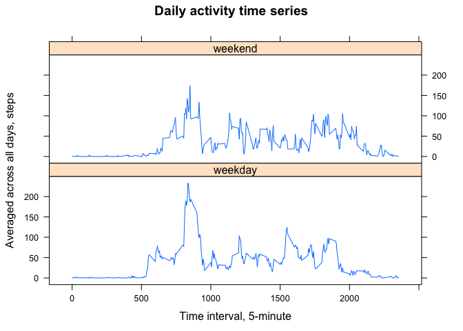

# Reproducible Research: Peer Assessment 1
Balistes  
17 july 2016 year   


## Loading and preprocessing the data
Create directory for dataset, load and unzip file, install packages. 


```r
Sys.setenv(LANGUAGE = "en")
Sys.setlocale("LC_TIME","C")
```

```
## [1] "C"
```

```r
if( !file.exists("./data")) {  
        dir.create("./data")  
        fileUrl <- "https://d396qusza40orc.cloudfront.net/repdata%2Fdata%2Factivity.zip"  
        dstf <- "./data/activity.zip"  
        download.file(fileUrl, destfile = dstf, method = "curl")  
        unzip(zipfile = dstf,exdir= "./data")  
} 

if(!is.element("lattice", installed.packages()[,1])) {
  install.packages("lattice")
}
```

Read file and create dataset.

```r
dataset <- read.table("./data/activity.csv", header = TRUE, sep = ",", na.strings = "NA")
dataset$date <- as.Date(dataset$date, "%Y-%m-%d")
```

## What is mean total number of steps taken per day?

Calculate the total number of steps taken per day.

```r
DaySteps <- tapply(dataset$steps,dataset$date,function(x) sum(x, na.rm = TRUE)) 
DaySteps
```

```
## 2012-10-01 2012-10-02 2012-10-03 2012-10-04 2012-10-05 2012-10-06 
##          0        126      11352      12116      13294      15420 
## 2012-10-07 2012-10-08 2012-10-09 2012-10-10 2012-10-11 2012-10-12 
##      11015          0      12811       9900      10304      17382 
## 2012-10-13 2012-10-14 2012-10-15 2012-10-16 2012-10-17 2012-10-18 
##      12426      15098      10139      15084      13452      10056 
## 2012-10-19 2012-10-20 2012-10-21 2012-10-22 2012-10-23 2012-10-24 
##      11829      10395       8821      13460       8918       8355 
## 2012-10-25 2012-10-26 2012-10-27 2012-10-28 2012-10-29 2012-10-30 
##       2492       6778      10119      11458       5018       9819 
## 2012-10-31 2012-11-01 2012-11-02 2012-11-03 2012-11-04 2012-11-05 
##      15414          0      10600      10571          0      10439 
## 2012-11-06 2012-11-07 2012-11-08 2012-11-09 2012-11-10 2012-11-11 
##       8334      12883       3219          0          0      12608 
## 2012-11-12 2012-11-13 2012-11-14 2012-11-15 2012-11-16 2012-11-17 
##      10765       7336          0         41       5441      14339 
## 2012-11-18 2012-11-19 2012-11-20 2012-11-21 2012-11-22 2012-11-23 
##      15110       8841       4472      12787      20427      21194 
## 2012-11-24 2012-11-25 2012-11-26 2012-11-27 2012-11-28 2012-11-29 
##      14478      11834      11162      13646      10183       7047 
## 2012-11-30 
##          0
```

Histogram of the total number of steps taken each day.

```r
hist(DaySteps,col="lightblue",xlab="Number of steps", main="Total number of steps taken each day")
```

<!-- -->

Calculate the mean and median of the total number of steps taken per day.

```r
Stmean <- mean(DaySteps, na.rm=TRUE)
Stmedian <- median(DaySteps,na.rm=TRUE)
```
The mean is : **9354.23** and the median is : **10395**.

## What is the average daily activity pattern?

A time series of the 5-minute interval (x-axis) and the average number of steps taken, averaged across all days (y-axis)

```r
steps_per_intv <- with(dataset, tapply(steps, interval, mean, na.rm = TRUE))
plot(unique(dataset$interval), steps_per_intv, type = "l", 
     main = "Daily activity time series", pch = 2, col = "darkblue",
     ylab = "Averaged across all days, steps", xlab = "Time interval, 5-minute")
```

<!-- -->

5-minute interval, on average across all the days in the dataset, that contains the maximum number of steps.

```r
maxvalue <- max( steps_per_intv )
maxnames <- names( which( steps_per_intv == max( steps_per_intv )))
```

The 5-minute interval, that contains the maximum number of steps is 835 with average number of 206.2 steps.    


## Imputing missing values

Calculate the total number of missing values in the dataset (i.e. the total number of rows with 𝙽𝙰s)

```r
sum(is.na(dataset))
```

```
## [1] 2304
```

Create new dataset for filling the all missing values. Next, create a new column in which fill in all values as mean of 5-minute interval. After that fill all the missing values with values from the new column.

```r
newdataset <- dataset
newdataset$msteps <- tapply(dataset$steps,dataset$interval,function(x) mean(x, na.rm = TRUE)) 
newdataset[is.na(newdataset$steps),]$steps <- newdataset[is.na(newdataset$steps),]$msteps
```

Create a new dataset that is equal to the original dataset but with the missing data filled in. Delete the new column and create a new dataset that is equal to the original dataset but with the missing data filled in.

```r
newdataset <- newdataset[-c(4)]
```
Check: number of the missing values in the new dataset

```r
sum(is.na(newdataset))
```

```
## [1] 0
```

Make a histogram of the total number of steps taken each day and Calculate and report the mean and median total number of steps taken per day. 

```r
NewDS <- tapply(newdataset$steps,newdataset$date,function(x) sum(x, na.rm = TRUE)) 
hist(NewDS,col="pink",xlab="Number of steps", main="Total number of steps taken each day (w/o missing values")
```

<!-- -->

Calculate the mean and median of the total number of steps taken per day for the new dataset.

```r
NewStmean <- mean(NewDS, na.rm=TRUE)
NewStmedian <- median(NewDS,na.rm=TRUE)
```

The mean is **10766.19** and the median is **10766** for the new dataset.


```r
diffmean <-  NewStmean - Stmean
diffmedian <- NewStmedian - Stmedian
```

The difference of mean values for the newdataset and dataset is : **1411.96**.  
The difference of median values for the newdataset and dataset is : **371**.  

The impact of imputing missing data on the estimates of the total daily number of steps is:    
 - we have received higher mean and median values for the total daily number of steps;  
 - w/o the missing values, the Histogram is closer to a normal distribution, so the values of the mean and median are closer to each other.  
  
## Are there differences in activity patterns between weekdays and weekends?

Use the newdataset with the filled-in missing values. Create a new factor variable in the dataset with two levels – “weekday” and “weekend” indicating whether a given date is a weekday or weekend day

```r
dayweek <- data.frame(
  cbind(
    name = c("Monday","Tuesday","Wednesday","Thursday","Friday",
             "Saturday","Sunday"),
      daytype = c(rep("weekday",5),rep("weekend",2))))
str(dayweek)
```

```
## 'data.frame':	7 obs. of  2 variables:
##  $ name   : Factor w/ 7 levels "Friday","Monday",..: 2 6 7 5 1 3 4
##  $ daytype: Factor w/ 2 levels "weekday","weekend": 1 1 1 1 1 2 2
```

Add a new column for the new dataset with "weekends" and "weekdays" values.

```r
daytype <- merge(dayweek,data.frame(
    name=weekdays(as.Date(newdataset$date))))$daytype
WeekDS <- cbind(newdataset,daytype)
```

Calculate the average number of steps taken for each interval, separately for weekdays and weekends and create dataset for plot

```r
PlotDS <- aggregate(WeekDS$steps,
                       by=list(WeekDS$interval,WeekDS$daytype),
                       function(x) mean(x,na.rm=TRUE))
names(PlotDS) <- c("interval","datetype","msteps")
```

Make a panel plot containing a time series plot of the 5-minute interval (x-axis) and the average number of steps taken. 

```r
library(lattice)

xyplot(PlotDS$msteps ~ PlotDS$interval |
         PlotDS$datetype , type = "l",
       ylab = "Averaged across all days, steps", xlab = "Time interval, 5-minute",
       main = "Daily activity time series", layout = c(1,2))
```

<!-- -->
